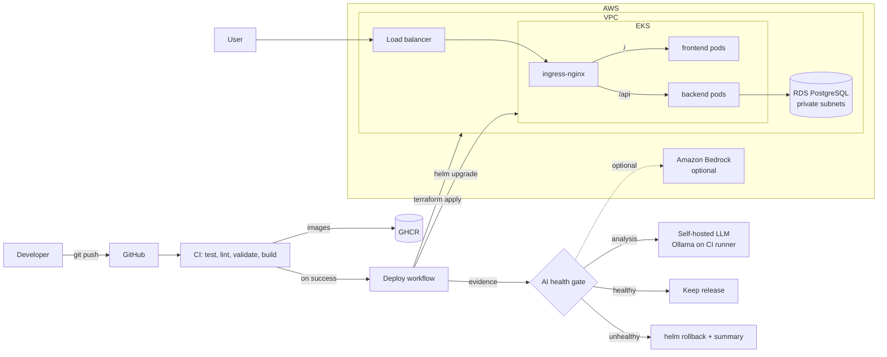

# 💡 Idea Board — an AI-assisted, cloud-agnostic DevOps platform

A small full-stack app (React + FastAPI + PostgreSQL) deployed on Kubernetes by an infrastructure-as-code pipeline. After every deploy, an **AI health gate** decides whether to keep the release or roll it back, and explains the problem in plain English.

| | |
|---|---|
| **Live URL (AWS)** | `http://<filled-in-after-deploy>` |
| **Stack** | React (Vite) · FastAPI · PostgreSQL · Docker · Terraform · EKS · RDS · Helm · ingress-nginx · GitHub Actions · Ollama (self-hosted LLM) / Amazon Bedrock |

---

## 1. Architecture



**Request path:** user → cloud load balancer → ingress-nginx → `/` frontend (nginx serving the React build) or `/api` backend (FastAPI) → PostgreSQL.

| Layer | Choice | Why |
|---|---|---|
| App | React + FastAPI + PostgreSQL | Matches the brief; FastAPI gives validation and OpenAPI docs for free |
| Containers | Dockerfiles that run as non-root; unprivileged nginx for the frontend | Small images, safe defaults |
| Registry | GitHub Container Registry | Not tied to any cloud, so every cluster pulls the same image |
| Orchestration | Kubernetes (EKS) | The portable layer: identical manifests on any cloud |
| Database | Managed PostgreSQL (RDS), private subnets, encrypted | Managed backups and patching; reachable only from cluster nodes |
| IaC | Terraform with modules and S3 remote state with locking | Reproducible infrastructure with a clean per-cloud boundary |
| Packaging | One Helm chart plus `values-<cloud>.yaml` | The same chart deploys to every cloud |
| CI/CD | GitHub Actions | Free for public repos; reusable workflows |
| AI | Open-source LLM (Qwen 2.5 3B) served by **Ollama on the CI runner**; Amazon Bedrock as a pluggable alternative | No API keys, no third-party data sharing, nothing that can be rate-limited or retired |

### Repository layout

```
backend/                FastAPI app, tests, Dockerfile
frontend/               React app, nginx config template, Dockerfile
docker-compose.yml      Full local stack
infra/
  bootstrap/aws/        One-time: state bucket + GitHub OIDC provider + pipeline IAM role
  modules/aws/          network (VPC) · cluster (EKS) · database (RDS)
  envs/aws/             Composes the modules; exposes the cloud-neutral output contract
deploy/helm/idea-board/ Cloud-neutral chart + values-aws.yaml
scripts/
  ai/                   AI health gate (evidence collection, LLM client, decision logic, tests)
.github/workflows/      ci.yml · deploy.yml · destroy.yml
```

---

## 2. Run locally (Docker Compose)

Prerequisite: Docker Desktop.

```bash
git clone https://github.com/sharathKumar-1123/idea-board.git
cd idea-board
docker compose up --build
```

- UI: http://localhost:3000
- API docs: http://localhost:8000/docs
- Try the API directly:
  ```bash
  curl -X POST localhost:8000/api/ideas -H 'Content-Type: application/json' -d '{"content":"My new idea"}'
  curl localhost:8000/api/ideas
  ```

Stop with `docker compose down` (add `-v` to wipe the database).

Run the tests without Docker:

```bash
cd backend && pip install -r requirements.txt -r requirements-dev.txt && pytest
cd scripts/ai && pip install -r requirements.txt pytest && pytest
```

---

## 3. Deploy to AWS

### 3.1 One-time setup (no long-lived access keys anywhere)

1. **Tools:** `aws` CLI ≥ 2.32, `terraform` ≥ 1.10, `kubectl`, `helm`.
2. **Log in to AWS with short-lived credentials** as an admin IAM identity (not the root user):
   ```bash
   aws login --region us-east-1   # browser sign-in; temporary credentials, nothing stored long-term
   aws sts get-caller-identity
   ```
3. **Bootstrap the account:** this creates the Terraform state bucket, the GitHub OIDC identity provider, and the IAM role the pipeline assumes.
   ```bash
   cd infra/bootstrap/aws
   terraform init && terraform apply
   terraform output   # state_bucket, github_actions_role_arn
   ```
   If the account already has a GitHub OIDC provider, run `terraform apply -var create_oidc_provider=false`.
4. **AI:** nothing to set up. The default provider runs an open-source model on the CI runner. *(Optional: to use Amazon Bedrock instead, enable a model in the Bedrock console and set `AI_PROVIDER=bedrock` and `BEDROCK_MODEL_ID`.)*
5. **GitHub repository variables** (Settings → Secrets and variables → Actions → *Variables*). None of these are secrets:

   | Name | Value |
   |---|---|
   | `AWS_ROLE_ARN` | `github_actions_role_arn` from step 3 |
   | `TF_STATE_BUCKET` | `state_bucket` from step 3 |
   | `AI_PROVIDER` (optional) | `ollama` (default), `bedrock` or `none` |
   | `OLLAMA_MODEL` (optional) | Default `qwen2.5:3b` |
   | `BEDROCK_MODEL_ID` (only for Bedrock) | Model or inference profile ID |

6. **Optional: kubectl access from your laptop.** The pipeline role creates the cluster, so add your own IAM principal ARN to `cluster_admin_arns` in `infra/envs/aws/terraform.tfvars`.

The container images are published to GHCR from this public repository and are public, so the cluster pulls them without credentials.

### 3.2 Deploy through the pipeline

- **Automatic:** push to `main`. CI tests and builds the images, then **Deploy** runs Terraform, Helm and the AI health gate.
- **Manual:** Actions → **Deploy** → *Run workflow* (optionally pick an `image_tag`).
- The **run summary** shows the application URL and the AI health report.

### 3.3 Deploy by hand (optional)

```bash
cd infra/envs/aws
terraform init -backend-config="bucket=<TF_STATE_BUCKET>" -backend-config="region=us-east-1"
terraform apply
$(terraform output -raw kubeconfig_command)
cd ../../..

helm upgrade --install ingress-nginx ingress-nginx/ingress-nginx \
  --repo https://kubernetes.github.io/ingress-nginx -n ingress-nginx --create-namespace --wait

kubectl create namespace idea-board
kubectl create secret generic idea-board-db -n idea-board \
  --from-literal=host="$(terraform -chdir=infra/envs/aws output -raw db_host)" \
  --from-literal=port="$(terraform -chdir=infra/envs/aws output -raw db_port)" \
  --from-literal=name="$(terraform -chdir=infra/envs/aws output -raw db_name)" \
  --from-literal=username="$(terraform -chdir=infra/envs/aws output -raw db_username)" \
  --from-literal=password="$(terraform -chdir=infra/envs/aws output -raw db_password)"

helm upgrade --install idea-board deploy/helm/idea-board -n idea-board \
  -f deploy/helm/idea-board/values-aws.yaml --wait

kubectl get svc ingress-nginx-controller -n ingress-nginx   # EXTERNAL-IP / hostname = app URL
```

### 3.4 Tear down

Actions → **Destroy** → type `aws`. This removes the Kubernetes load balancer first and then runs `terraform destroy`. The default sizing costs roughly **$6–8 per day**.

---

## 4. AI integration

### The problem

A deployment can report "success" while the application is broken: pods crash-loop, the database is unreachable, an image tag doesn't exist. Someone then has to read pod statuses, events and logs to work out what happened and whether to roll back. That is slow, needs Kubernetes expertise, and usually happens under pressure.

### What I built: an AI health gate with automatic rollback

After every `helm upgrade`, [`scripts/ai/health_check.py`](scripts/ai/health_check.py) runs these steps:

1. **Collects evidence:** pod phase, readiness, restarts and waiting reasons; recent Kubernetes events; the last 80 backend log lines; HTTP probes against the public URL (`/api/health`, `/api/ideas`, `/`).
2. **Runs deterministic hard checks:** CrashLoopBackOff, image pull errors, no ready pods, failing HTTP probes.
3. **Asks an LLM** (by default an open-source **Qwen 2.5 3B** model served by **Ollama on the CI runner itself**; Amazon Bedrock is a drop-in alternative) to assess the evidence using a structured prompt ([`prompt.md`](scripts/ai/prompt.md)). It must return strict JSON: `healthy`, `confidence`, `summary`, `likely_cause`, `suggested_fix`.
4. **Decides** whether to keep the release or roll it back with `helm rollback`.
5. **Explains:** writes a human-readable report to the GitHub Actions run summary and uploads the full evidence and verdict as a `health-report` artifact.

Example output for a deploy with a broken database host:

> ## ❌ Deployment unhealthy
> **Decision:** Hard checks failed.
> - Pod idea-board-backend-7c9… is in CrashLoopBackOff.
> - GET http://…/api/health failed: status=503
>
> ### 🤖 AI analysis
> - **Summary:** The backend cannot start because it fails to resolve the database host.
> - **Likely cause:** `DB_HOST` points to `db.invalid.example`, which does not resolve.
> - **Suggested fix:** Verify the `idea-board-db` secret / Helm values and redeploy.
>
> ### ↩️ Rolled back to the previous release

### Why a self-hosted model by default

I started with a hosted API (Amazon Bedrock), then made a self-hosted open-source model the default for three reasons:

- **Privacy:** pod logs and events can contain sensitive details. With Ollama on the runner, they never leave the pipeline.
- **Reliability:** hosted options can be throttled, retired or blocked by account limits (new-account quotas, marketplace billing). A pinned open model in CI depends on none of these.
- **Cost and portability:** it's free, needs no keys, and works the same whichever cloud the app is deployed to.

The trade-off is a smaller model and roughly 1 extra minute per deploy (model download is cached between runs). Because the decision rules are enforced in code, a smaller model is enough: it explains failures, and it never gets the final say on its own. For deeper analysis, set `AI_PROVIDER=bedrock`.

### Design choices: making it safe, not a gimmick

| Principle | How it's enforced |
|---|---|
| **The AI never executes anything** | The LLM only returns a JSON verdict. The pipeline's own code chooses between two fixed actions: keep or `helm rollback`. No LLM-generated commands are ever run. |
| **The AI can only make the gate stricter** | Hard-check failures always mean rollback, even if the AI says "healthy". The AI can fail an otherwise-passing release (for example, error patterns in logs), but only above a confidence threshold (default 0.7). |
| **Graceful degradation** | If the model is unavailable, too slow, or returns invalid JSON, the gate falls back to hard checks only, so a broken AI never blocks or approves a deploy on its own. |
| **Validated output** | The response is parsed and schema-checked, and confidence is clamped to 0–1. Anything malformed is discarded. |
| **No secrets, no data leaving the pipeline** | The default LLM runs on the CI runner, so logs and events are never sent to a third party and there is no API key to manage or leak. When Bedrock is used, it is called with the pipeline's existing AWS identity; Terraform creates a least-privilege `bedrock:InvokeModel` policy for that case. |
| **Provider-agnostic** | [`ai_client.py`](scripts/ai/ai_client.py) has one interface with interchangeable backends (`ollama`, `bedrock`, `none`), selected by the `AI_PROVIDER` variable. |
| **Tested** | The decision logic and parser have unit tests ([`test_health_check.py`](scripts/ai/test_health_check.py)) that run in CI. |

### Value to the DevOps lifecycle

- **Faster recovery:** a bad release is detected and reverted within minutes, without anyone on-call having to act.
- **Faster diagnosis:** the summary names the likely cause and the next step, instead of "deploy failed, go read the logs".
- **An audit trail:** every deploy keeps its evidence and verdict as an artifact.

### Try it: chaos demo

Actions → **Deploy** → *Run workflow* → `chaos`:

- `bad-db`: points the backend at a non-existent database host, so the pods crash-loop.
- `bad-image`: deploys an image tag that doesn't exist, so the image pull fails.

Watch the gate flag the release, explain why, and roll back to the last good revision.

### Future AI extensions

- **Goal-based environment config:** turn `goal: cost-sensitive staging` into Helm values (replicas, resources, autoscaling), validated against a JSON schema with hard limits before applying.
- **Terraform plan review:** summarize each PR's `terraform plan` in plain English and flag risky changes (database replacement, security-group widening) as a PR comment.

---

## 5. Cloud-agnostic approach

The platform is split into a **thin cloud-specific layer** and a **cloud-neutral layer**:

```
          cloud-specific                         cloud-neutral
┌───────────────────────────────┐    ┌─────────────────────────────────────┐
│ infra/modules/<cloud>/        │    │ Docker images (GHCR)                │
│   network · cluster · database│ →  │ Helm chart (deploy/helm/idea-board) │
│ infra/envs/<cloud>/           │    │ ingress-nginx                       │
│   → standard output contract  │    │ AI health gate (kubectl + HTTP)     │
└───────────────────────────────┘    │ CI workflow                         │
                                     └─────────────────────────────────────┘
```

**The output contract.** Every `infra/envs/<cloud>` exposes the same outputs: `cloud`, `region`, `cluster_name`, `kubeconfig_command`, `db_host`, `db_port`, `db_name`, `db_username`, `db_password`. The deploy workflow reads only these, so everything after `terraform apply` (database secret creation, Helm, the AI gate) is identical for every cloud.

**Portable building blocks:**
- **Kubernetes** is the runtime abstraction, and the chart uses only standard resources (Deployment, Service, Ingress).
- **ingress-nginx** gives every cloud the same public entry point. On any cloud, its `LoadBalancer` Service gets an external address from that cloud's load balancer.
- **Images live in GHCR**, not ECR/GCR/ACR, so they can be pulled from anywhere.
- **The AI gate** only uses `kubectl` and HTTP. The LLM provider is pluggable and separate from where the app runs.

**Adding a cloud (for example GCP):**
1. Add `infra/modules/gcp/{network,cluster,database}` (VPC, GKE, Cloud SQL).
2. Add `infra/envs/gcp` that composes them and exposes the **same output contract** (for example `kubeconfig_command = "gcloud container clusters get-credentials …"`).
3. Add `deploy/helm/idea-board/values-gcp.yaml` (usually just a few lines, or empty).
4. Point the deploy workflow at the new environment with `CLOUD=gcp` and `TF_DIR=infra/envs/gcp`, plus that cloud's login step.

No application code, chart templates or AI logic change.

> **Current status:** the submission is deployed on **AWS**. The second-cloud environment was not deployed within the time available. The steps above describe exactly what's required, and the layering is designed so it doesn't touch the cloud-neutral layer.

---

## 6. Security & production notes

- **No long-lived cloud credentials.** GitHub Actions authenticates to AWS through **OIDC**: GitHub signs a token that identifies the repository and branch, and AWS exchanges it for credentials that expire within 2 hours. The role's trust policy accepts only the `main` branch of this repository. Humans use `aws login` (short-lived browser sessions).
- Containers run as non-root with dropped capabilities and seccomp `RuntimeDefault`. The backend has a read-only root filesystem.
- RDS is in private subnets, encrypted at rest, and reachable only from the cluster's node security group.
- The database password is generated by Terraform, stored in encrypted S3 state, masked in CI logs, and injected as a Kubernetes Secret.
- Terraform state uses S3 with versioning, encryption and native lockfile locking.

**What I'd do next for production:** narrow the pipeline role from AdministratorAccess to a scoped policy, and require a GitHub Environment approval for production applies; HTTPS with cert-manager and a real domain; AWS Secrets Manager with External Secrets instead of passing passwords through CI; HPA and PodDisruptionBudgets; Multi-AZ RDS and per-AZ NAT gateways (one `tfvars` change); Prometheus metrics as extra evidence for the AI gate.
